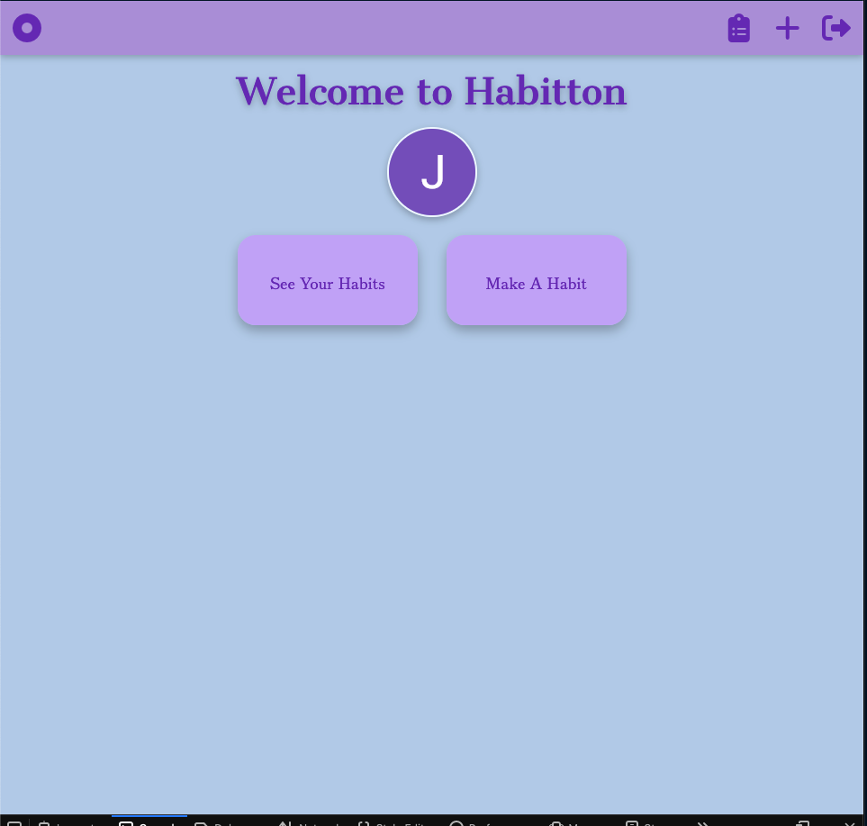
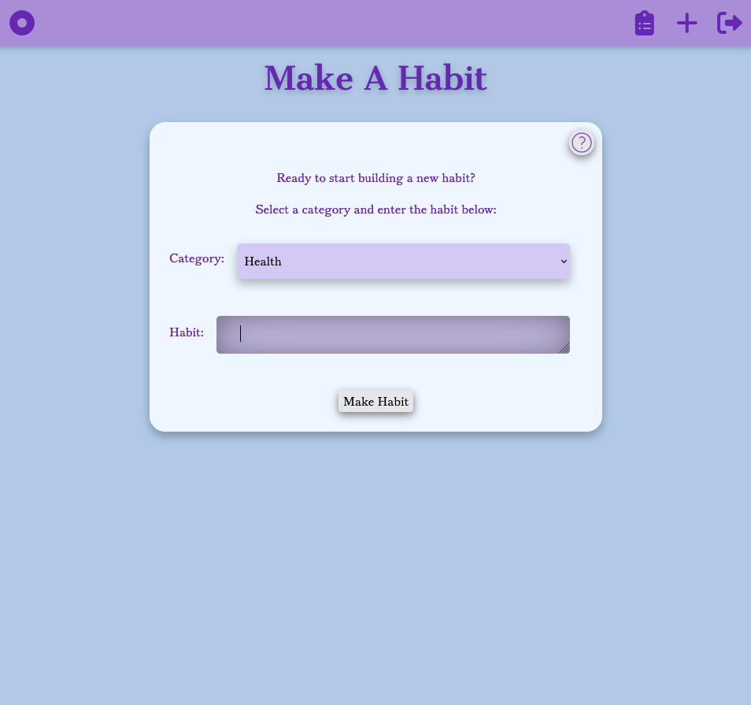
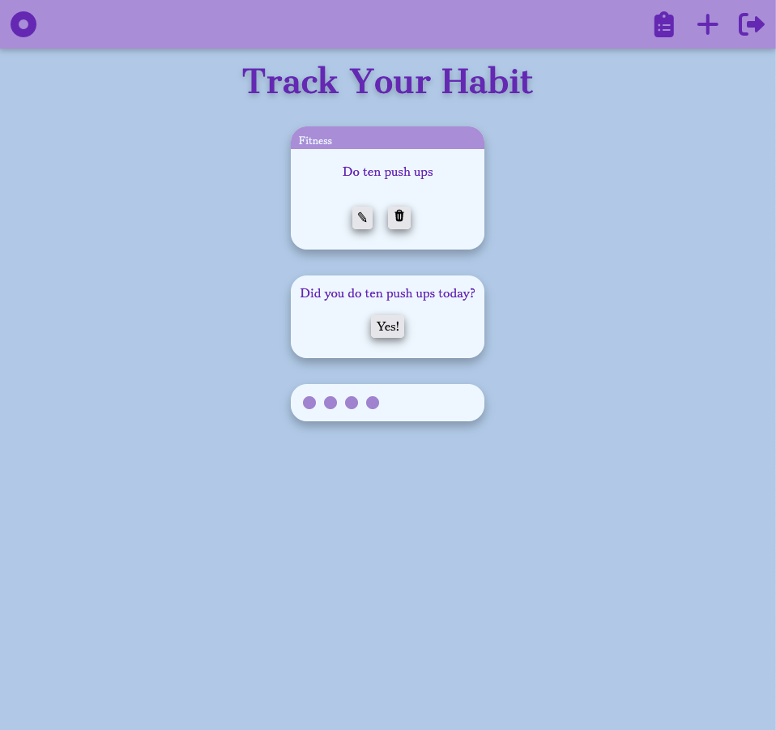
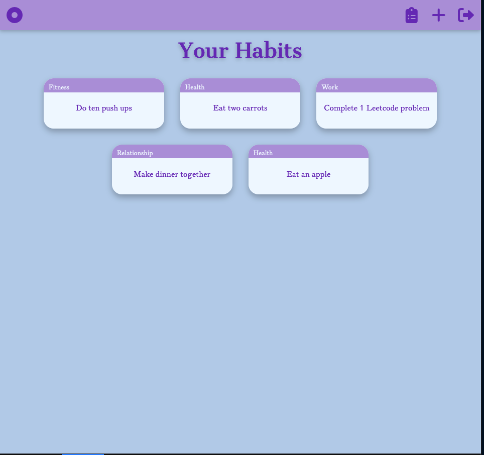

# Welcome to Habitton

Habitton helps you create new daily habits. Log in with your Google account, make new habits, and view all your habits. 

Once you log in, you'll see links to create a new habit or view all your habits. "Make A Habit" takes you to the new habit view, where you can select a habit category and create a habit. "See Your Habits" brings you to a view of all your habits. From there, you can click on a habit to mark it complete for that day, or edit/delete the habit. 

Mark your habits as complete each day and rack up completion dots! 

## Getting Started

[Planning Materials](https://trello.com/b/4zHD4W1o/habitton)

[Launch Habitton](https://habitton.fly.dev/)

## Screenshots

## Technologies Used

Javascript, HTML, CSS, Express, MongoDB, Node.js, Google OAuth, Azure

## Next Steps

- [ ] Add a comment log for each habit with timestamped comments.
- [ ] Group habits by category.
- [ ] Replace complete dots with a 7x7 grid -- if a habit is completed, a square will fill in, if a day is missed, the square is left blank.

## Thanks to

Font Awesome, Bootstrap, Heroicon 

Ian Terada and Hunter Long for helping me figure out my code. 